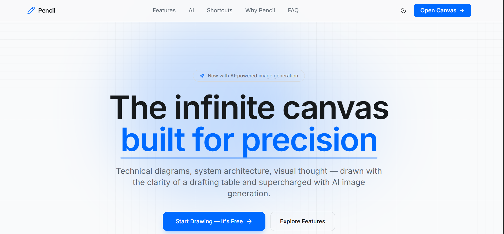
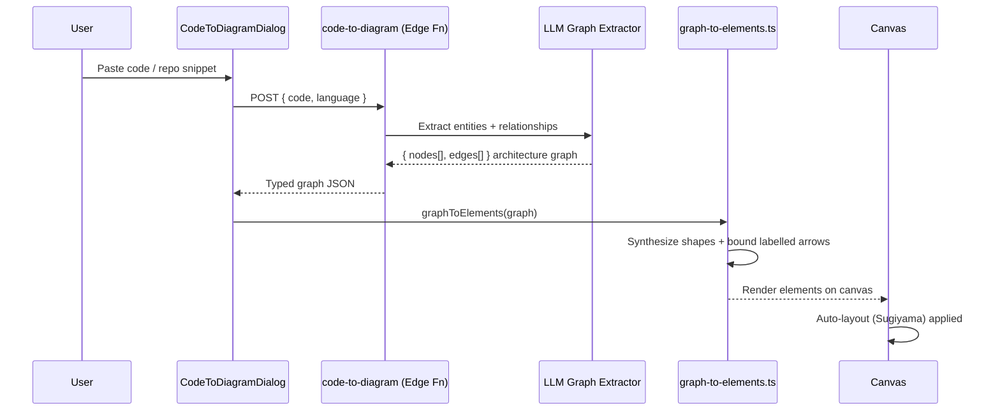
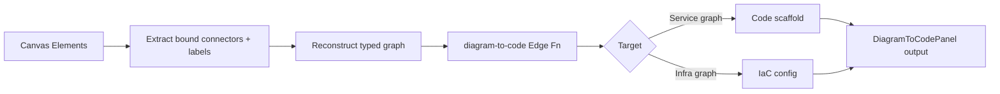
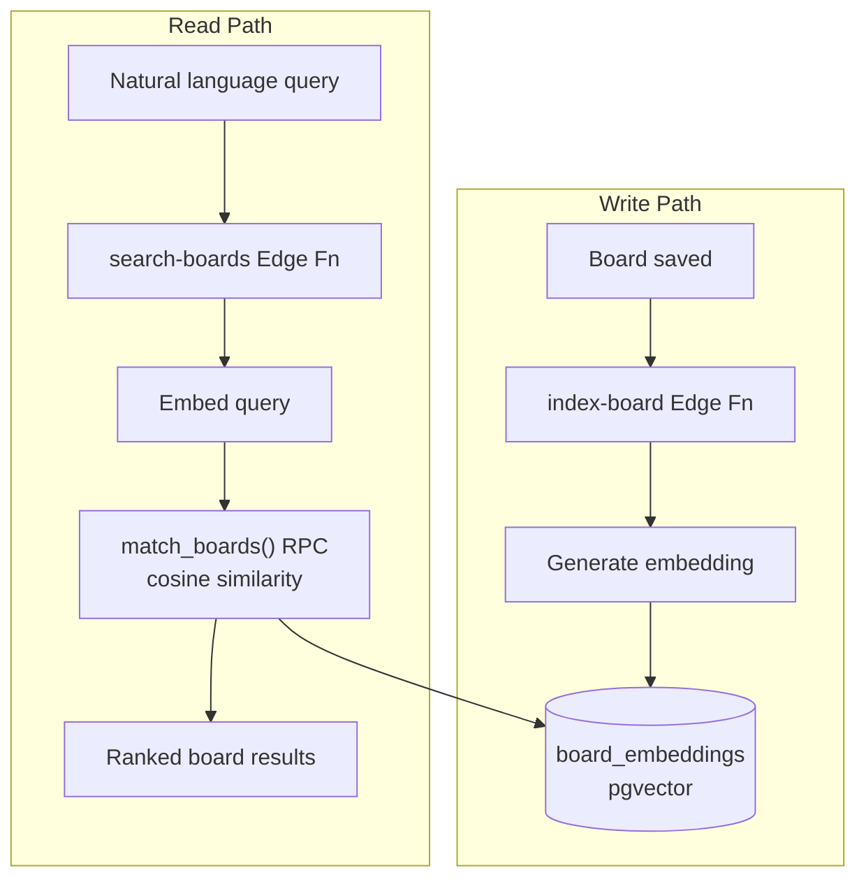
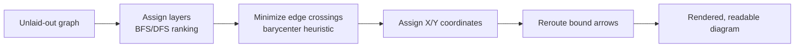
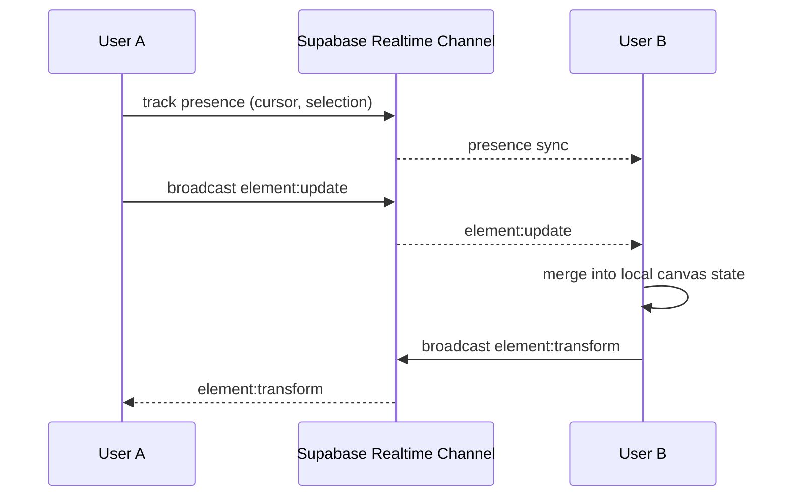
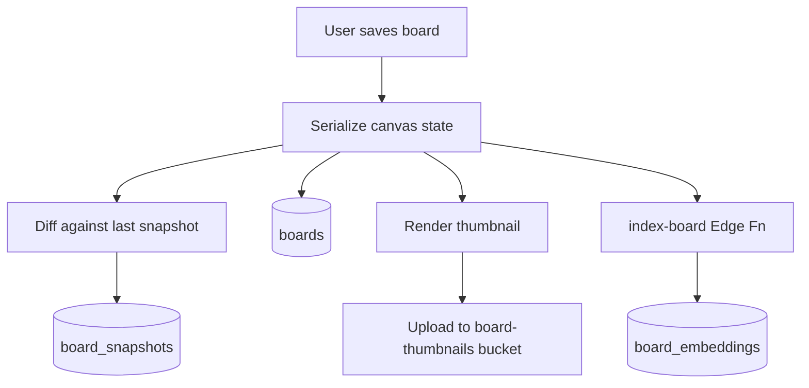
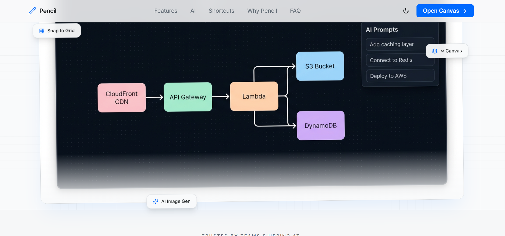
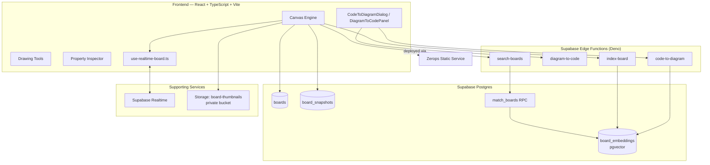
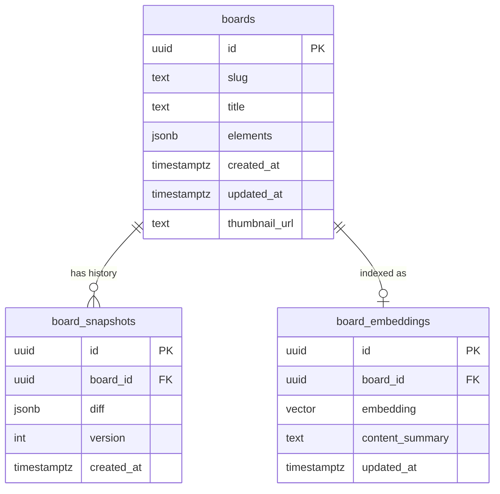

# ✏️ Pencil — The Infinite Canvas, built for Engineers



**Pencil** is a full-stack, real-time collaborative whiteboard built for people who think in systems — architecture diagrams, technical sketches, and visual thought. It combines a hand-built infinite-canvas drawing engine with three AI-native workflows that turn drawings into code and code into drawings.

Built with a technical drafting aesthetic: 0.5px grid lines, a bottom-docked instrument tray, mechanical button presses, and Drafting Blue accents.

**Live demo:** [static-2afb.prg1.zerops.app](https://static-2afb.prg1.zerops.app)

---

## Table of Contents

- [Why Pencil](#why-pencil)
- [Feature Matrix](#feature-matrix)
- [AI-Native Features](#-ai-native-features)
- [Non-AI Engineering Features](#-non-ai-engineering-features)
- [System Architecture](#system-architecture)
- [Database Schema](#database-schema)
- [Core Drawing Engine](#core-drawing-engine)
- [Tech Stack](#tech-stack)
- [Getting Started](#getting-started)
- [Environment Variables](#environment-variables)
- [Project Structure](#project-structure)
- [Testing](#testing)
- [Keyboard Shortcuts](#keyboard-shortcuts)
- [Roadmap](#roadmap)

---

## Why Pencil

Most whiteboard tools stop at "draw a box and connect it to another box." Pencil treats diagrams as **structured, queryable, executable artifacts** — not just pixels. You can go from a codebase to a diagram, from a diagram back to code, and search across every board you've ever made using natural language — all without leaving the canvas.

---

## Feature Matrix

| # | Feature | Type | Complexity driver |
|---|---------|------|--------------------|
| 1 | Code → Diagram | 🤖 AI | Static analysis + LLM graph extraction → typed shape synthesis |
| 2 | Diagram → Code | 🤖 AI | Graph traversal → IaC/code generation with bound-label inference |
| 3 | Semantic Board Search | 🤖 AI | Vector embeddings (pgvector) + cosine similarity RPC |
| 4 | Auto-Layout Engine | ⚙️ Non-AI | Sugiyama layered graph layout algorithm |
| 5 | Real-Time Collaboration | ⚙️ Non-AI | Presence protocol + operational element broadcast |
| 6 | Cloud Persistence & Versioning | ⚙️ Non-AI | Structural diffing, snapshotting, thumbnail pipeline |

---

## 🤖 AI-Native Features

### 1. Code → Diagram

Paste a code snippet, a file, or a directory tree — the `code-to-diagram` edge function parses it, extracts entities (services, modules, data stores, API boundaries) and their relationships, and hands off a typed **architecture graph** to `graph-to-elements.ts`, which synthesizes it into real canvas shapes: typed rectangles, labelled diamonds for decision points, and **bound arrows** (arrows that stay attached to their shapes even when you move them).



### 2. Diagram → Code

The inverse flow. Draw your architecture — boxes for services, arrows for data flow, diamonds for branching logic — and `DiagramToCodePanel` walks the bound-connector graph, resolves labels back into semantic relationships, and sends it to the `diagram-to-code` edge function, which emits working code or infrastructure-as-code scaffolding.



### 3. Semantic Board Search

Every board is embedded and indexed the moment it's saved. The `index-board` function generates a vector embedding of the board's content (element labels, structure, metadata) and stores it in `board_embeddings` via `pgvector`. The `search-boards` function takes a natural-language query, embeds it the same way, and runs a `match_boards` similarity RPC against Postgres — so "find the board with the auth flow I sketched last week" actually works, even if you never named it that.



---

## ⚙️ Non-AI Engineering Features

### 4. Auto-Layout Engine (`src/lib/auto-layout.ts`)

A from-scratch implementation of layered graph layout, independent of any AI call:

- **Sugiyama layered auto-layout** — assigns elements to layers, minimizes edge crossings, and positions nodes to produce readable top-down or left-right flows
- **Smart connector bindings** — arrows bind to shape anchors, not fixed coordinates
- **Edge-anchored rerouting** — moving a bound shape live-reroutes every connected arrow around obstacles
- **Snap guides + align/distribute** — Figma-style alignment guides and equal-spacing distribution across selections



### 5. Real-Time Collaboration (`src/hooks/use-realtime-board.ts`)

Built on Supabase Realtime channels — no polling:

- **Presence cursors** — every connected user's cursor position and selection state is broadcast and rendered live
- **Element broadcast** — element create/update/delete/transform operations are streamed to all participants on the same board channel and merged into local canvas state



### 6. Cloud Persistence & Versioning (`src/lib/board-store.ts`)

- **Cloud save/load** with shareable slugs (`/board/:slug`)
- **Snapshots + structural diffing** — every save is diffed against the last snapshot so history is compact, not a full-state dump every time
- **Thumbnail pipeline** — canvas is rendered to an image and uploaded to a private `board-thumbnails` storage bucket on save
- **Search indexing** — every save triggers re-indexing for semantic search (see AI feature #3)



---

## System Architecture





---

## Database Schema



Realtime is enabled on `boards` for live sync. `board-thumbnails` is a private Storage bucket, access-controlled per board owner.

---

## Core Drawing Engine

The foundation everything else is built on:

- **9 tools** — Select, Rectangle, Ellipse, Diamond, Line, Arrow, Freehand, Text, Eraser
- **Infinite canvas** — pan via scroll/drag, zoom via `Ctrl` + scroll
- **Selection & transform** — resize handles on all 8 points, multi-select
- **Property Inspector** — stroke color, fill, stroke width/style, opacity
- **Undo/Redo** — `Ctrl+Z` / `Ctrl+Shift+Z`
- **Export** — PNG export via `Ctrl+E`
- **Technical grid** — togglable 0.5px drafting grid
- **Status bar** — live coordinates, zoom %, element count

---

## Tech Stack

| Layer | Technology |
|---|---|
| Frontend | React + TypeScript, Vite, Tailwind CSS, shadcn/ui |
| Backend | Supabase Edge Functions (Deno runtime) |
| Database | Supabase Postgres + `pgvector` extension |
| Realtime | Supabase Realtime (presence + broadcast channels) |
| Storage | Supabase Storage (private bucket) |
| Testing | Playwright (E2E), Vitest (unit) |
| Hosting | Zerops (static service, SPA fallback built in) |

---

## Getting Started

```bash
# clone
git clone https://github.com/Anurag13075/pencil-sketchpad.git
cd pencil-sketchpad

# install
npm install

# configure environment (see below)
cp .env.example .env

# run
npm run dev
```

## Environment Variables

Vite bakes `VITE_`-prefixed variables into the bundle at **build time**, so these must be set before running `npm run build`:

```bash
VITE_SUPABASE_URL=https://your-project.supabase.co
VITE_SUPABASE_ANON_KEY=your-anon-key
```

Edge functions (deployed separately via Supabase CLI) use their own service-level secrets — never expose the `service_role` key client-side.

## Project Structure

```
pencil-sketchpad/
├── src/
│   ├── lib/
│   │   ├── auto-layout.ts        # Sugiyama layout, bindings, snap guides
│   │   ├── graph-to-elements.ts  # architecture graph → canvas shapes
│   │   └── board-store.ts        # save/load, snapshots, thumbnails, search indexing
│   ├── hooks/
│   │   └── use-realtime-board.ts # presence + element broadcast
│   ├── components/
│   │   ├── CodeToDiagramDialog.tsx
│   │   ├── DiagramToCodePanel.tsx
│   │   └── ...canvas, tools, inspector components
│   └── pages/
├── supabase/
│   ├── functions/
│   │   ├── code-to-diagram/
│   │   ├── diagram-to-code/
│   │   ├── index-board/
│   │   └── search-boards/
│   └── migrations/                # boards, board_snapshots, board_embeddings
├── public/
└── zerops.yml
```

## Testing

```bash
npm run test        # Vitest unit tests
npm run test:watch  # watch mode
npx playwright test # E2E tests
```

## Keyboard Shortcuts

| Key | Action |
|---|---|
| `V` | Select tool |
| `R` | Rectangle |
| `O` | Ellipse |
| `D` | Diamond |
| `L` | Line |
| `A` | Arrow |
| `P` | Freehand (pencil) |
| `T` | Text |
| `E` | Eraser |
| `Ctrl+Z` | Undo |
| `Ctrl+Shift+Z` | Redo |
| `Ctrl+E` | Export PNG |
| `Ctrl+Scroll` | Zoom |

## Roadmap

- [ ] Multiplayer cursors with named avatars
- [ ] Diagram diffing between snapshots (visual, not just structural)
- [ ] Export to Mermaid / PlantUML source
- [ ] Team workspaces with shared board libraries

---

Built for a hackathon, engineered like production infrastructure.
